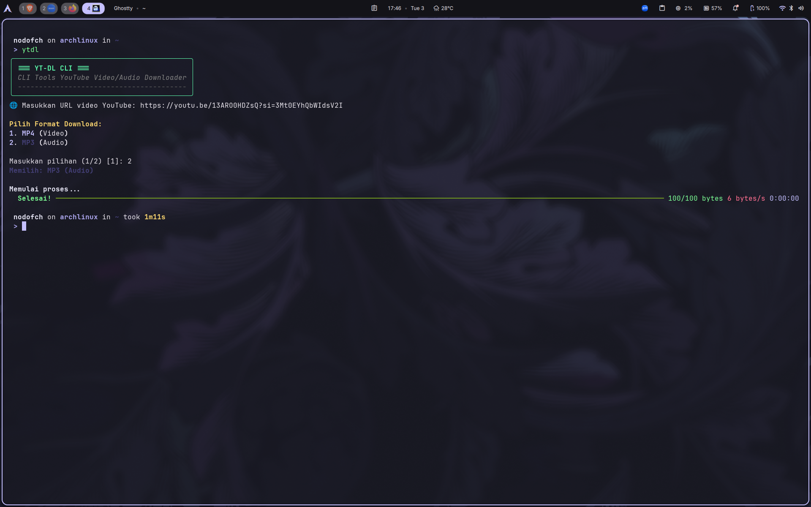

# YT-DL CLI (Arch Linux Style)

Aplikasi CLI minimalis dan interaktif untuk mendownload video atau audio dari YouTube. Dibangun dengan Python, **uv**, **Typer**, dan **Rich** untuk pengalaman terminal yang modern.



## ✨ Fitur
- 🖥️ **Dashboard Interaktif**: Antarmuka terminal yang bersih dan berwarna.
- 📥 **Input Mudah**: Tidak perlu argumen panjang, cukup masukkan URL saat diminta.
- 🔄 **Pilihan Format**: Pilih antara **MP4 (Video)** atau **MP3 (Audio)** secara langsung.
- 📊 **Progress Bar Cantik**: Pantau kecepatan download dan estimasi waktu secara real-time.
- ⚡ **Ringan & Cepat**: Menggunakan `uv` untuk manajemen paket yang efisien.

## 🛠️ Prasyarat
Pastikan sistem kamu sudah terinstall **FFmpeg** (untuk penggabungan video & audio):

```bash
# Arch Linux
sudo pacman -S ffmpeg

# Ubuntu / Debian
sudo apt install ffmpeg

# Fedora
sudo dnf install ffmpeg
```

## Instalasi
Ikuti langkah dibawah untuk menginstal Tools:
```bash
git clone https://github.com/nodofch/YouTube-Downloader-CLI.git
cd YouTube-Downloader-CLI
uv tool install . --force
uv tool update-shell
```

## Cara Penggunaan
Ketik di terminal kamu:
```bash
ytdl
```
